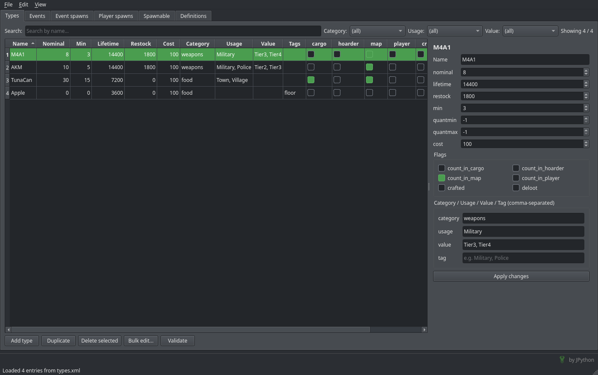

  

<h1 align="center">DayZ XML Editor</h1>

  Wieloplatformowy edytor plików XML ekonomii (Central Economy) serwera DayZ. 
  Zakładki dla <b>types</b>, <b>events</b>, <b>cfgeventspawns</b>,
  <b>cfgplayerspawnpoints</b>, <b>cfgspawnabletypes</b> i
  <b>cfglimitsdefinition</b> — z trybem misji, edycją masową, walidacją między
  plikami, cofaniem zmian i ciemnym/jasnym motywem.

  

---

## ⬇️ Pobieranie (dla użytkowników)

Nie musisz instalować Pythona ani niczego dodatkowego — pobierasz gotowy plik.

1. Wejdź do zakładki **[Releases](../../releases)** tego repozytorium.
2. Pobierz plik dla swojego systemu:
   - **Windows** → `DayZEditor.exe`
   - **Linux** → `DayZEditor-x86_64.AppImage`
3. Uruchom:
   - Windows: dwuklik w `DayZEditor.exe`.
   - Linux: nadaj prawo wykonania (`chmod +x DayZEditor-x86_64.AppImage`) i uruchom.

> **Windows SmartScreen** przy pierwszym uruchomieniu może pokazać niebieskie
> okno „Windows chronił Twój komputer". To normalne dla niepodpisanego programu —
> kliknij **Więcej informacji → Uruchom mimo to**.

## ✨ Funkcje

- **Tryb misji** (`File → Open Mission Folder`) — wskaż folder misji, a narzędzie
  samo wczyta `db/types.xml`, `db/events.xml`, `cfgeventspawns.xml`,
  `cfgplayerspawnpoints.xml`, `cfgspawnabletypes.xml` i `cfglimitsdefinition.xml`
  do właściwych zakładek. **Save All** (`Ctrl+Shift+S`) zapisuje wszystkie
  zmienione pliki jednym skrótem.
- **Sześć edytorów w zakładkach** — types, events, event spawns, player spawns,
  spawnabletypes, definitions; każda z własną historią zmian i znacznikiem `*`.
- **Tabela wszystkich wpisów** z sortowaniem po kolumnach; flagi klikasz
  bezpośrednio w tabeli (kolumny checkbox).
- **Wyszukiwanie po nazwie** oraz filtry (np. `category`/`usage`/`value`)
  łączone warunkiem I.
- **Edycja pojedyncza** — panel ze wszystkimi polami wpisu:
  - *types*: skalary, flagi oraz listy `category/usage/value/tag` (z podpowiedziami
    z cfglimitsdefinition);
  - *events*: skalary, `position`/`limit`, flagi oraz **tabela `children`**;
  - *spawnabletypes*: **drzewo `attachments`/`cargo`** z itemami i szansami;
  - *event spawns*: **tabela pozycji** `<pos x z a>` dla eventu;
  - *player spawns*: grupy punktów spawnu graczy (fresh/hop/travel) z tabelą
    pozycji.
- **Edycja masowa** — zaznacz wiele wpisów (lub ustaw filtr) i zmień je naraz:
  ustaw / dodaj / pomnóż wartości liczbowe, włącz/wyłącz flagi, dodaj/usuń/zamień
  wartości list.
- **Duplikowanie** wpisu (`Ctrl+D`) jako baza nowego.
- **Walidacja + synergia między plikami** — duplikaty, złe zakresy, eventy bez
  `children`; wartości `usage/value/category/tag` spoza cfglimitsdefinition
  (uwzględnia też grupy z `cfglimitsdefinitionuser.xml`); wpisy spawnabletypes
  bez `<type>` w types.xml oraz pozycje eventów bez `<event>` w events.xml.
  Kliknięcie problemu zaznacza dany wpis.
- **Cofnij / Ponów** (`Ctrl+Z` / `Ctrl+Y`) dla każdej zmiany.
- **Ciemny / jasny motyw** — przełącznik w menu **View**, zapamiętywany między
  uruchomieniami.
- **Bezpieczny zapis** — zachowuje komentarze i formatowanie pliku; zmiana
  jednego pola daje jednoliniowy diff, w pełni czytelny dla silnika DayZ.

## 🖱️ Szybki start

1. **File → Open Mission Folder** i wskaż folder misji
   (np. `mpmissions/dayzOffline.chernarusplus/`) — zakładki wypełnią się same.
   Alternatywnie **File → Open** wczytuje pojedynczy plik do aktywnej zakładki.
2. Edytuj pojedynczo (panel po prawej → **Apply changes**) lub masowo
   (**Bulk edit…**).
3. **Validate**, żeby sprawdzić poprawność (w tym niespójności między plikami).
4. **File → Save** (`Ctrl+S`) zapisuje aktywną zakładkę, a **Save All**
   (`Ctrl+Shift+S`) — wszystkie zmienione naraz. Tytuł okna i zakładka pokazują
   `*`, gdy są niezapisane zmiany.

---

---

## 📄 Licencja

Oprogramowanie **własnościowe** (proprietary) — **nie** jest to projekt
open-source. Możesz **pobierać i używać** programu za darmo do własnych,
prywatnych celów, ale **nie wolno** go modyfikować, redystrybuować ani poddawać
inżynierii wstecznej. **Użycie komercyjne wymaga pisemnej zgody autora.**

Pełne warunki: [LICENSE](LICENSE). Komponenty firm trzecich (PySide6/Qt, lxml,
Python, PyInstaller) pozostają pod własnymi licencjami — zob.
[THIRD_PARTY_NOTICES.md](THIRD_PARTY_NOTICES.md).

© 2026 Johny Python (JPython). Wszelkie prawa zastrzeżone.
DayZ jest znakiem towarowym Bohemia Interactive a.s.; to narzędzie jest
niezależne i niepowiązane z Bohemia Interactive.
